# Fetch code

Script to loop over the Excel file in a chosen order. This script is meant to streamline the process of uploading the indicator files.

## Preparation

### Installing pip

1. Make sure you have a compatible version of Python 3. [You can download it here](https://www.python.org/downloads/).
2. Make sure Python's package installer (pip) is added to your system variables.

   - Press the Windows-key and type "Edit the system environment variables"

     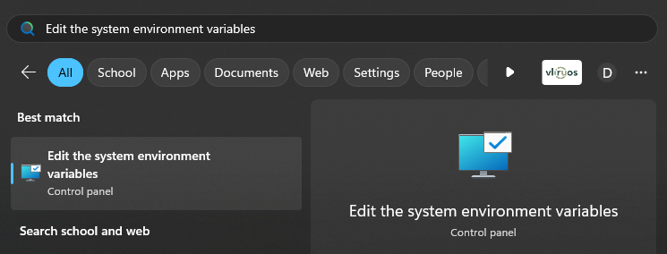
   - Select "Environment Variables..."

     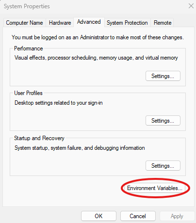
   - You'll see two "tables" with information. One contains all the "User variables" (i.e. variables regarding the identity of the user you are logged in as. For example: the location of your OneDrive directory), the other contains all the "System variables" (i.e. variables regarding the whole system. For example: the Windows directory)

     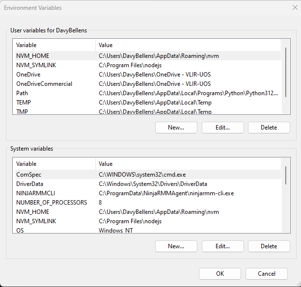

     **(Your configuration might look different)**
   - Go to the "User variables" table and look for the "Path" variable.
   - If it doesn't exists, you can create it by clicking "New" and entering "Path" as the variable name. For the value, press "Browse directory" and navigate to the "Scripts" folder within the "Python" directory (vb. C:\Users\DavyBellens\AppData\Local\Programs\Python\Python312\Scripts)
   - If the "Path" variable does exist, double click it. This should open up a new screen where you can add an extra entries

     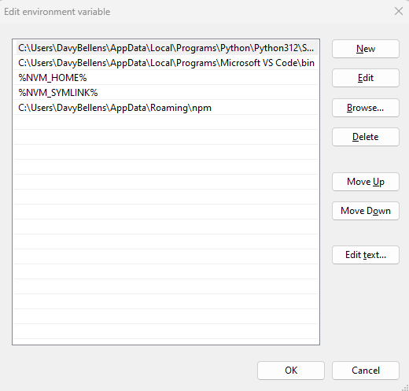
   - Simply press "New", paste the path to the Scripts folder within the Python directory (vb. C:\Users\DavyBellens\AppData\Local\Programs\Python\Python312\Scripts), and move it up to the top with the "Move Up" button.
   - Now test if this works by opening up a new Command Prompt

     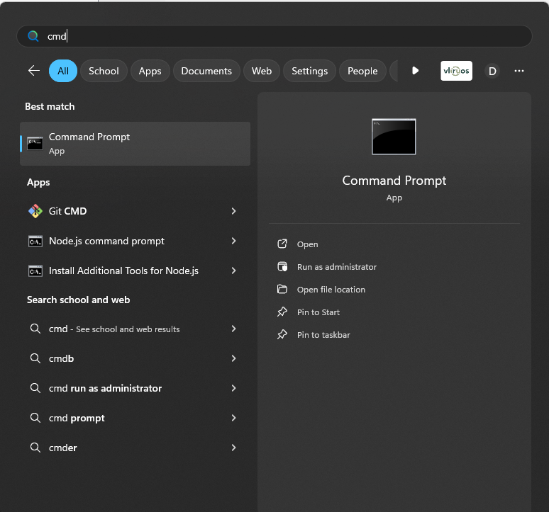
   - And typing "pip -V" to check the version Python's package installer (pip) -> Note that it's a **capital** V
   - You should see something like this:

     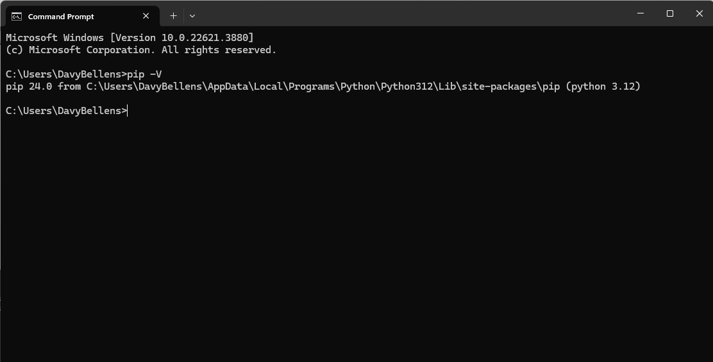
   - If it doesn't work, give it some time. If it still doesn't work after some time you could restart your computer and/or look up a tutorial online (in case I missed something)

### Installing required packages (libraries)

1. Open file explorer and navigate to this directory (vb. C:\Users\DavyBellens\OneDrive - VLIR-UOS\Documenten\vliruos-scripts\fetch_code)
2. Click the Path-bar up top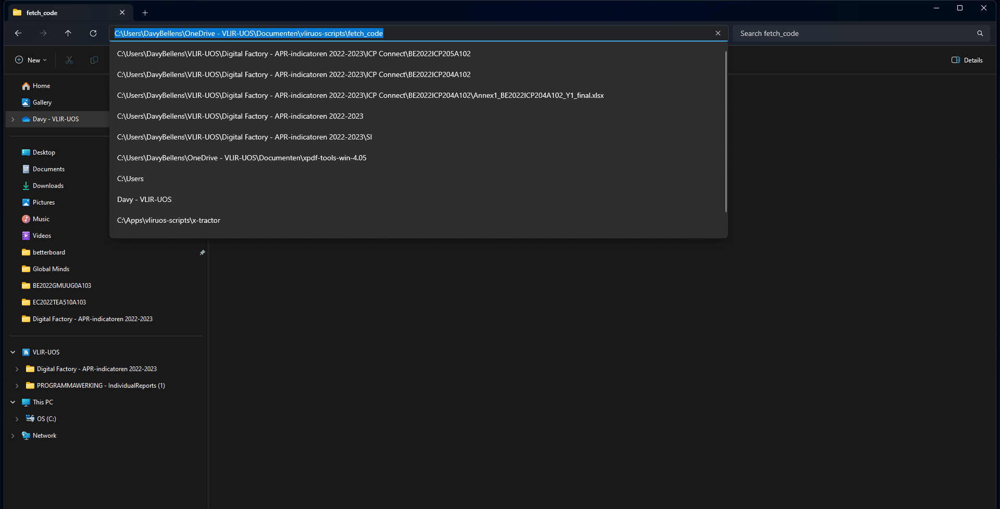
3. Now type "cmd" and hit Enter, you should see something like this:

   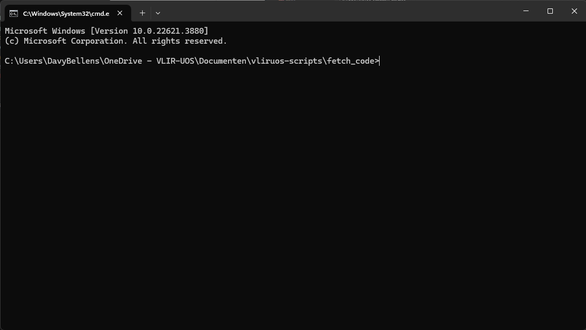
4. Now type: pip install -r requirements.txt

   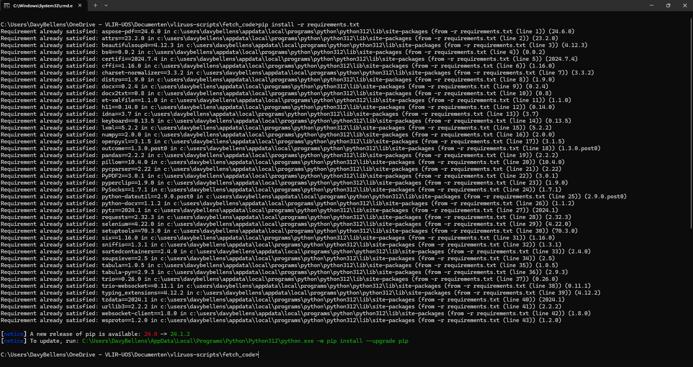
5. This will download all the necessary libraries for you. If you get a message saying a new version of pip is available you can update it if you want to. It should tell you how you can do this (as seen on the previous image). It's a good habit but it's not really required for the script.

## Updating variables

### copy_code.py

1. On line 156 (or 157 depending on formatting settings) I specified the location of the Excel file

   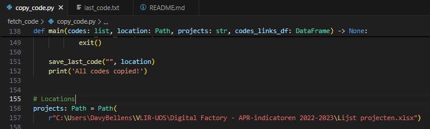
2. Change this path with the path to the file on **your** pc (vb. C:\Users\\**Jefke**\VLIR-UOS\Digital Factory - APR-indicatoren 2022-2023\Lijst projecten.xlsx)

### copy_code.bat

How it works (simplified):

* first I give the path to **my** python executable, the thing that runs python code
* secondly I give the path to **my** python file

The python executable executes the code from the provided python file.

* [ ] You now understand how computers work

As you can see, this is based on the locations of the files on **my** laptop, so you'll have to change it if you want to run it.

1. In the .bat file, I specified the path to my python.exe file: "C:\Users\DavyBellens\AppData\Local\Programs\Python\Python312\python.exe"

   * This will be different for you so you must replace this with the path to your python.exe file. (You can look up online how to find this file)
2. Next to the path to my python.exe file is the absolute path to the Python file. So, locate the file (with File Explorer) and copy the path from the bar up top:

   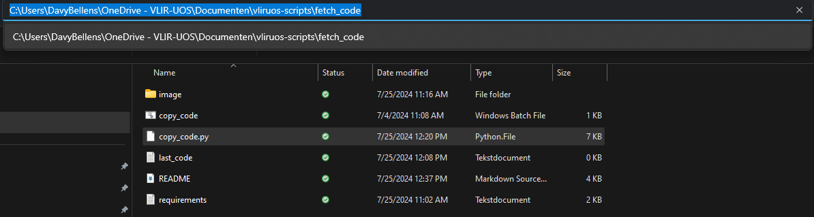
3. Now paste this in a text editor
4. And just append it with the name of the file (vb. C:\Users\DavyBellens\OneDrive - VLIR-UOS\Documenten\vliruos-scripts\fetch_code\copy_code.py)
5. Now replace the path in the .bat file with this path

### Shortcut

1. Go to the folder in File Explorer
2. Right click the .bat-file and click "Show more options"
3. Navigate to "Send to" and select "Desktop (create shortcut)"

   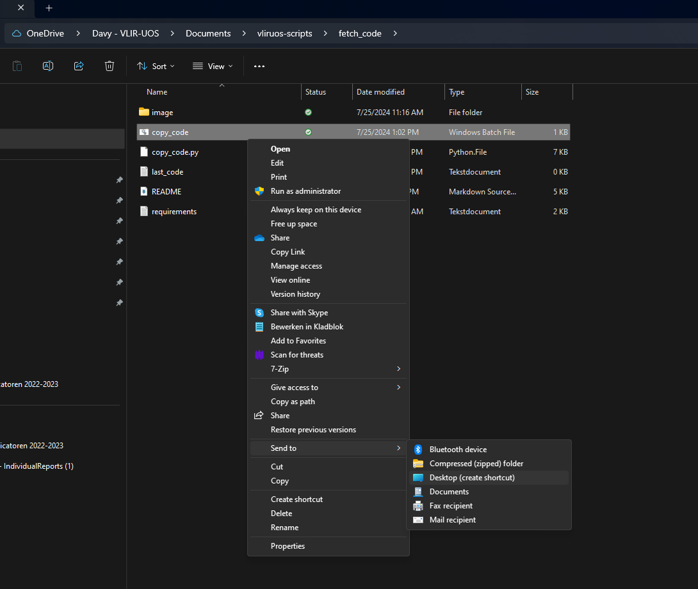
4. Check if the shortcut is created
5. Right click the shortcut and click "Poperties"
6. Under "Run", select "Maximized"

   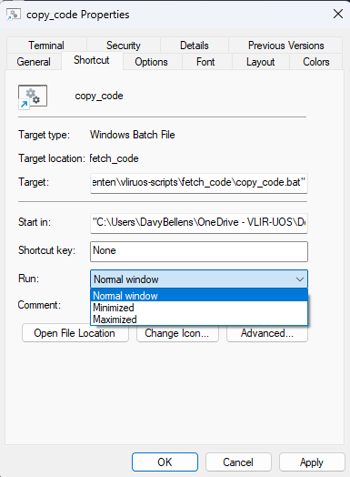

Now you can easily run the script.

## Rules

### Excel file can't be open

So basically when you run the script, it first checks if the Exel file is opened. If it is, it asks you to close it and run the script again. It needs to be able to read this file and it can't do that when it's opened somewhere else.

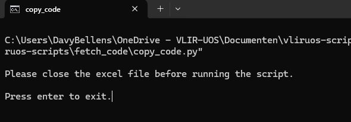

### You shouldn't make changes in the Excel file while the script is running

The script depends on being the only "person" that can edit the file. If you do edit it whilst the script is running, you risk the chance of losing your progress.

### Read carefully

If it is your first time using it, read the prompts very carefully.

## Example usage

### Choose a column

Choose one of the columns from the Excel file.

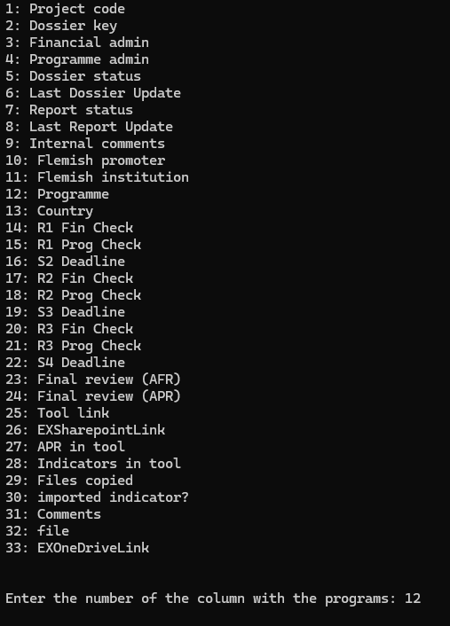

### Choose a value

Choose one of the values that is found in the selected column.

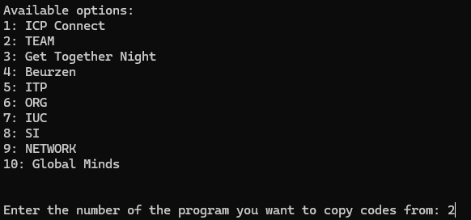

### Loop starts

After selecting the value, the loop instantly starts. It does as programmed, it copies the project's code, opens the tool link, and shows which file it wants to open.

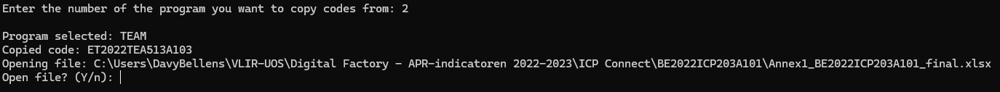

If you don't want to open the file, you type 'n' or 'N', otherwise you type nothing and press enter. This will open the file so that you can check some things before you upload it. You can also first try to upload it, see what the errors are, and then open it to correct these errors. It's up to you.

### No file

If there is no file you will see either one of these:

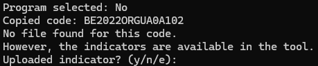

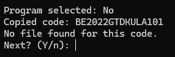

The first one means that the script I used to find the file didn't work properly. I'm a human, I make mistakes. Just see if you can upload it. If you can, great, if you can't also great.

Second one is obvious, if my script didn't find a file, and there was a "No" in the "Indicators in tool"-column, it means there **most likely** was no indicator file uploaded.

### Logging

This is very straightforward. You're prompted for the status of the upload (i.e. were you able to upload it?).

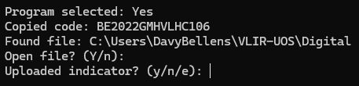

* You were able to upload it

  * type 'y' and hit Enter

  writes '**Yes**' in the 'imported indicator?'-column
* You were unable to upload it (file was missing, there was no place to upload it)

  * type 'n' and hit Enter

  writes '**No**' in the 'imported indicator?'-column
* You encountered an error while uploading the file

  * type 'e' and paste the error from the tool
  * You might get a warning like this one

    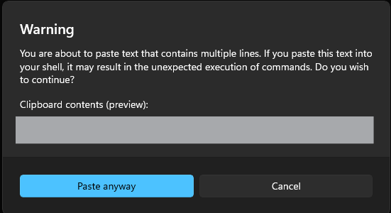
  * Select "Paste anyway" (my script is built to accept multiline input)
  * End with and empty line

    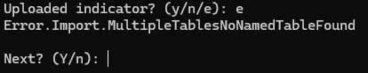

  writes **the provided error** int the 'imported indicator?'-column

### Next?

If you want to continue to the next project, type nothing and just hit enter (Y is the default). If you **do** want to quit for whatever reason, you can type 'n'.

This will save the code of the last project you did, to a file called (you guessed it) **last_code.txt** (in the same directory as the copy_code file)

The next time you start the script, **if you select the same column and value as last time**, it will continue from the last project you did because it saved that project's code.

### EOL (End Of List)

If you have looped over all the rows in the **column** with your chosen **value**. You will receive a message saying "All codes copied!".

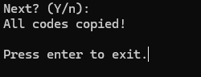

You can then hit Enter to exit.
